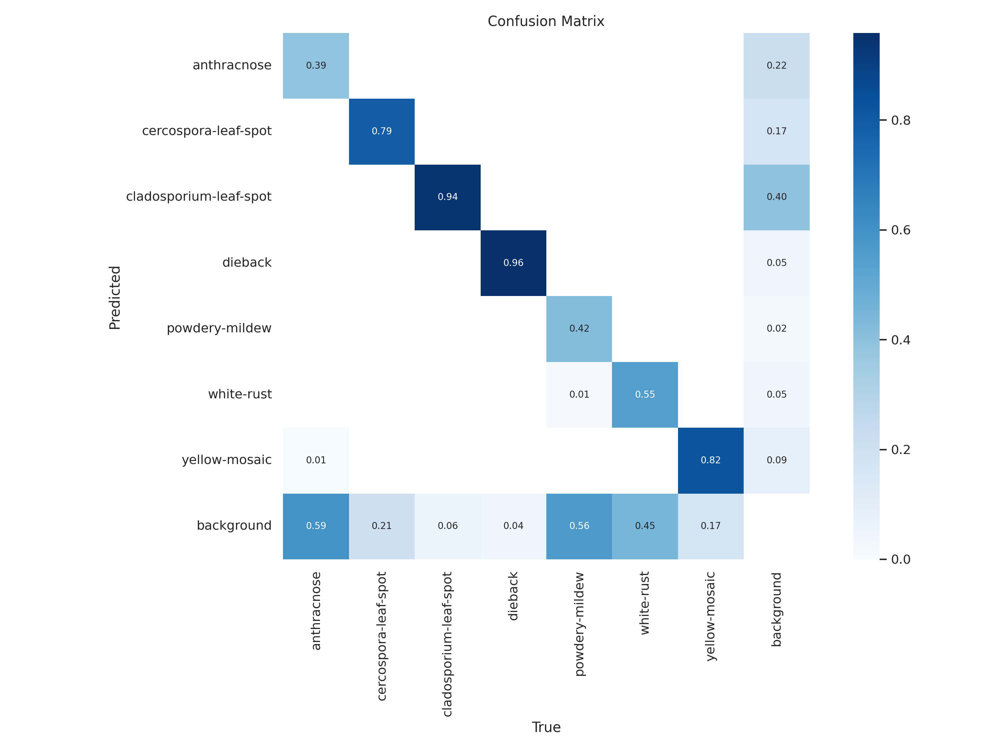

# Disease Detection and Segmentation Model

This model is for disease detection and segmentation using YOLOv8, a state-of-the-art object detection and segmentation framework

## How to use

To use this model, you need to download the following files from this folder:

- test.py: This is a Python script that contains the code for loading and testing the model on new images. You can run it on your local machine or a cloud platform.
- disease_model.pt: This is the saved model file that contains the weights and architecture of the YOLOv8 network. You need to place it in the same directory as test.py.
- model.ipynb: This is a Jupyter notebook that contains the code for creating and training the model. You can run it if you want to see how the model was built and trained.

## Data source

The model was trained on images from the following source:

- Disease Segmentation: https://universe.roboflow.com/thesisp2segmentation/yolov5seg-p0vlj/browse?queryText=&pageSize=50&startingIndex=0&browseQuery=true

The images were resized to 640x640 pixels and augmented with random rotations, flips, and crops.

## Results

The model achieved an average precision (AP) of 87% and an average recall (AR) of 85% on the test set, which consisted of 100 images. The confusion matrix and some sample predictions are shown below:

